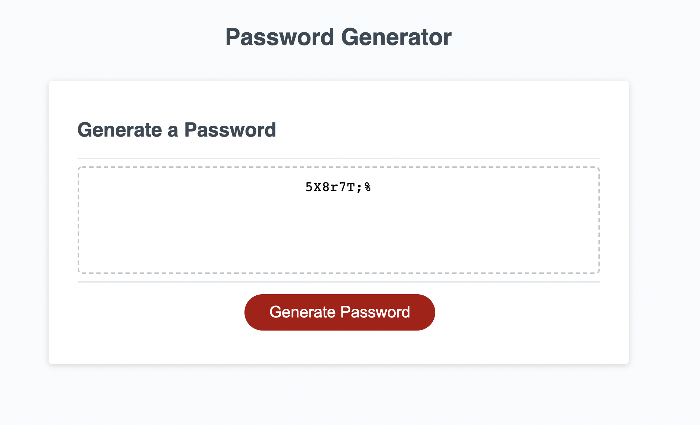

# Random Password Generator

## Description
Create random password generator that meets certain criteria in order to provide greater security

## Criteria
- Password length (at least 8 characters and no more than 128 characters)
- Ask user if they would like to include: lowercase, uppercase, numeric and/or special characters

## Screenshot

## Deployed Page
https://chindatrate.github.io/randompasswordgenerator/

## GitHub Repository
https://github.com/chindatrate/randompasswordgenerator